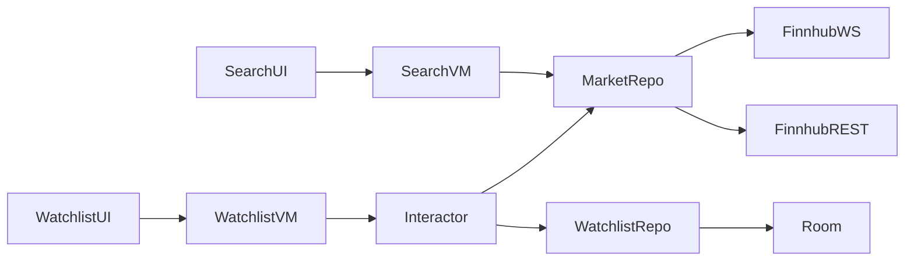

# Real-Time Watchlist

A small Android app for searching financial instruments, managing a persistent watchlist, and receiving live price updates via Finnhub REST and WebSocket APIs.

## Quick start

1. Open the project in Android Studio (Ladybug or newer recommended).
2. Add your Finnhub API key to `local.properties` in the project root (this file is gitignored):

```properties
FINNHUB_API_KEY=your_finnhub_token
```

Get a free key at [finnhub.io](https://finnhub.io/). After changing `local.properties`, sync Gradle and rebuild so `BuildConfig` picks up the new value.

3. Sync Gradle and run the `app` configuration on an emulator or device (API 24+).

## Features

- Search instruments (stocks, crypto, forex supported by Finnhub)
- Add and remove watchlist items
- REST snapshot quotes on load
- WebSocket trade stream for live updates
- Persistent watchlist (Room)
- UI states for loading, empty, error, stale prices, and reconnecting stream

## Architecture and tradeoffs

The app uses a simple layered structure:

```
UI (Compose + ViewModels)
        ↓
Domain (interactors, models, repository interfaces)
        ↓
Data (Room, Retrofit, OkHttp WebSocket)
```

### Key components

| Layer | Responsibility |
|-------|----------------|
| `SearchViewModel` | Debounced search, add-to-watchlist actions |
| `WatchlistInteractor` | Merges persisted watchlist, REST quotes, and live stream into screen state |
| `MarketDataRepository` | Finnhub REST + WebSocket integration |
| `RoomWatchlistRepository` | Local watchlist persistence |
| `FinnhubWebSocketClient` | Subscribe/unsubscribe, reconnect with exponential backoff |

`WatchlistInteractor` is an application-scoped singleton so WebSocket subscriptions survive tab switches between Search and Watchlist.

### Data flow



### Tradeoffs

- **Interactor vs ViewModel logic** — Watchlist state merging (quotes + stream + stale detection) lives in `WatchlistInteractor` to keep the ViewModel thin and unit-testable without Android framework dependencies.
- **Trade stream as live price** — Finnhub's free WebSocket sends trades, not consolidated quotes. The last trade price is shown as the live price.
- **Stale threshold (30 s)** — Prices older than 30 seconds, or received while reconnecting, are labeled stale instead of silently shown as live.
- **Single WebSocket connection** — One socket per app instance with dynamic subscribe/unsubscribe; aligns with Finnhub's one-connection-per-key limit.
- **No offline quote cache** — Watchlist symbols persist, but prices are refetched on launch; keeps scope small for the exercise.

### Finnhub assumptions (free tier)

- REST rate limits apply (HTTP 429 when exceeded; the app surfaces a clear error).
- WebSocket supports a limited number of concurrent symbol subscriptions (commonly ~50).
- US stock trades are most reliable during market hours; crypto uses exchange-prefixed symbols (e.g. `BINANCE:BTCUSDT`).
- `/quote` may return `c = 0` when no current price is available.

## Tests

Unit tests focus on domain and presentation logic that does not require a device or network.

### What is covered

| Test file | Coverage |
|-----------|----------|
| `SearchViewModelTest` | Successful search, failed search (error message), add-to-watchlist UI update |
| `WatchlistInteractorTest` | Empty watchlist state, REST quote → screen entry, live price override |

`MainDispatcherRule` supports ViewModel tests by setting a test `Main` dispatcher.

### What is not covered

- Finnhub REST/WebSocket clients (would need mock web server or fakes)
- Room DAO integration tests
- Compose UI or instrumented end-to-end tests (optional per the brief)

### How to run
In Android Studio: open the **Project** view, right-click `app/src/test/java` → **Run 'Tests in …'**.


## AI / tooling assistance
This project was implemented with assistance from Cursor (AI pair programming) for scaffolding, boilerplate, and documentation. Architectural decisions, tradeoffs and final code structure were reviewed and intentionally kept minimal.
