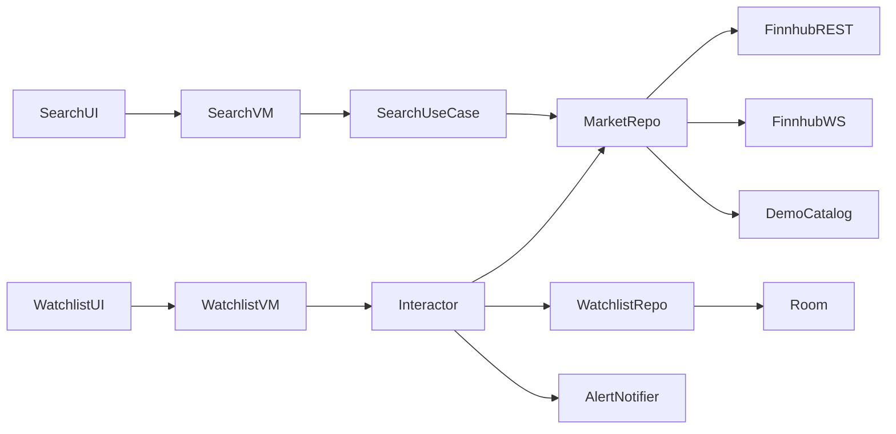

# Real-Time Watchlist

Android app for searching instruments, maintaining a watchlist, and watching live prices (Finnhub or built-in demo data).

## Build and run

### Prerequisites

- **Android Studio** Ladybug or newer (recommended)
- **JDK 11+** (project uses Android Studio’s bundled JBR via `gradle.properties`)
- **Android device or emulator** — API 24+ (Android 7.0)
- **Finnhub API key** (optional — see [Demo / fake-data mode](#demo--fake-data-mode))
  (Get a free key at [finnhub.io](https://finnhub.io/).)

### Gradle notes

- `FINNHUB_API_KEY` and `DEMO_MODE` are injected into `BuildConfig` at build time from `local.properties`.
- After changing `local.properties`, sync Gradle and rebuild so `BuildConfig` picks up new values.

---

## Demo / fake-data mode

Reviewers can run the full product flow **without a Finnhub API key**, market hours, or rate limits.

### When demo mode is active

Demo mode turns on automatically when `FINNHUB_API_KEY` is **missing or blank**. You can also force it with `DEMO_MODE=true`.

- **Search** — filters a local catalog (`DemoMarketCatalog`: AAPL, MSFT, BTC, EUR/USD)
- **Quotes** — returns fixed snapshot prices from the catalog
- **Live prices** — `FakeMarketDataRepository` emits simulated price ticks (~every 2 s with small jitter)
- **Historical charts** — synthetic candle series for sparklines
- **Watchlist** — still persisted in Room; add/remove and price alerts work normally
- **UI** — a demo mode banner appears at the top of the home screen

Finnhub Retrofit and WebSocket clients are **not created** in demo mode. Hilt swaps only `MarketDataRepository` via a `Provider`-based `@Provides` binding.

### Live mode

Provide a valid key and ensure demo mode is not forced.

- **REST** — `/search`, `/quote`, and candle endpoints for search, snapshots, and history
- **WebSocket** — Finnhub trade stream for live updates (`wss://ws.finnhub.io`)

---

## Features

- **Search** — debounced instrument search with add-to-watchlist
- **Watchlist** — live price, change, percent change, live/stale/unavailable status, pull-to-refresh
- **Live updates** — WebSocket trades in live mode; simulated ticks in demo mode
- **Historical sparkline** — 30-day history in the detail pane, with a live tip overlay
- **Price alerts** — set above/below threshold per item; one-shot notification on cross (latched so oscillation around the level cannot spam)
- **Pagination** — watchlist pages of 5 items; charts load for the visible page only
- **Home-screen widgets** — Glance watchlist and top-quote widgets with cached quotes
- **Adaptive UI** — Material 3 navigation suite + list-detail scaffold across phone/tablet widths
- **Error handling** — Finnhub auth, rate-limit, and API errors mapped to user-facing copy

---

## Architecture and tradeoffs

### Layered structure

```
UI (Jetpack Compose + ViewModels)
        ↓
Domain (use cases, interactors, models, repository interfaces)
        ↓
Data (Room, Retrofit, OkHttp WebSocket, demo fakes)
```

**Tech stack:** Kotlin, Jetpack Compose, Coroutines/Flow, Hilt, Room, Retrofit, OkHttp, Glance, Material 3 Adaptive, kotlinx.serialization.

### Key components

- **`SearchViewModel`** — `SearchUiState` via `StateFlow`; debounced search + membership via `SearchWithWatchlistUseCase`
- **`WatchlistViewModel`** — maps interactor overview into paginated `WatchlistScreenState`, chart tip overlays, and alert actions
- **`WatchlistInteractor`** — application-scoped singleton; merges Room watchlist, REST quotes, coalesced live ticks, price-alert evaluation, stale detection, and connection state
- **`PriceAlertEvaluator`** — crossing + one-shot latch so alerts fire once per arming
- **`MarketDataRepository`** — Finnhub (`FinnhubMarketDataRepository`) or demo (`FakeMarketDataRepository`)
- **`RoomWatchlistRepository`** — persists watchlist and per-symbol alert settings
- **`FinnhubWebSocketClient`** — single socket, latest-trade-per-symbol batching, exponential backoff reconnect

### Data flow



### Performance notes

- Live ticks coalesce (~300 ms) before UI updates
- Quote refresh runs with limited parallelism
- Chart history loads for the visible page only; live tip does not rewrite the series
- Widget quote cache (~30 s) and debounced membership-driven refreshes

### Tradeoffs

- **`WatchlistInteractor` vs fat ViewModel** — quote/stream merging and stale logic stay testable without Android APIs; subscriptions survive tab switches
- **Reactive search pipeline** — query + watchlist symbols combine in the use case so the ViewModel does not own mutable membership state
- **Trade stream as live price** — Finnhub free WebSocket sends trades, not consolidated quotes; last trade price is shown as live
- **One-shot price alerts** — crossing into the threshold zone notifies once, then latches until the user clears or resets the alert
- **30 s stale threshold** — older prices (or reconnecting without fresh ticks) are labeled stale, not silently “live”
- **Single WebSocket connection** — matches Finnhub’s one-connection-per-key limit
- **No offline quote cache** — symbols (and alerts) persist in Room; prices refetch on launch
- **Demo mode via repository swap** — same UI and persistence without network

### Finnhub assumptions and limitations (free tier)

- REST rate limits apply — HTTP **429** surfaces a user-facing error
- WebSocket supports a limited number of concurrent subscriptions (commonly ~50)
- US stock trades are most reliable during **market hours**; crypto often needs exchange-prefixed symbols (e.g. `BINANCE:BTCUSDT`)
- Stock candle history may be restricted on free plans — demo mode uses synthetic history
- `/quote` may return `c = 0` when no current price exists — shown as unavailable (`—`)
- WebSocket reconnect uses exponential backoff (2 s base, 60 s cap; longer delay on 429)

---

## Tests

### Unit tests (`app/src/test`)

- **`SearchViewModelTest`** — successful/failed search, add-to-watchlist, demo catalog
- **`WatchlistInteractorTest`** — empty watchlist, REST quote → live entry, coalesced live override
- **`WatchlistViewModelTest`** — empty/paginated state, live chart tip, paging
- **`PriceAlertEvaluatorTest`** — threshold crossing and one-shot latch / anti-flap behavior
- **`DemoMarketCatalogTest`** / **`FakeMarketDataRepositoryTest`** — demo search, quotes, tick flow
- Widget and mapper coverage for watchlist widget data and candle mapping

### Instrumented / UI tests (`app/src/androidTest`)

- **`SearchScreenTest`** — idle, results, add/added, error, no results
- **`WatchlistScreenTest`** — empty, entries, connection banner, remove, loading, pagination
- **`HomeNavigationTest`** — navigation suite tabs and shell content
- **`DemoModeBannerTest`** — demo banner visibility

## Screenshots

Launcher, demo, and live screenshots:

<p>
  
  
  
  
</p>
